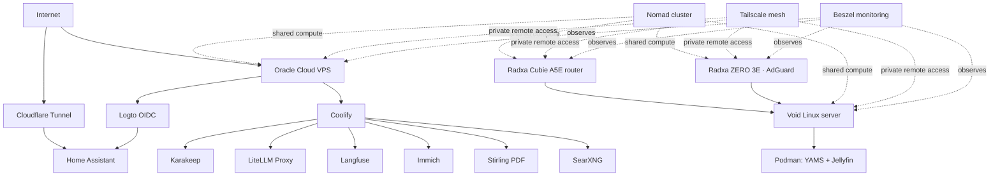
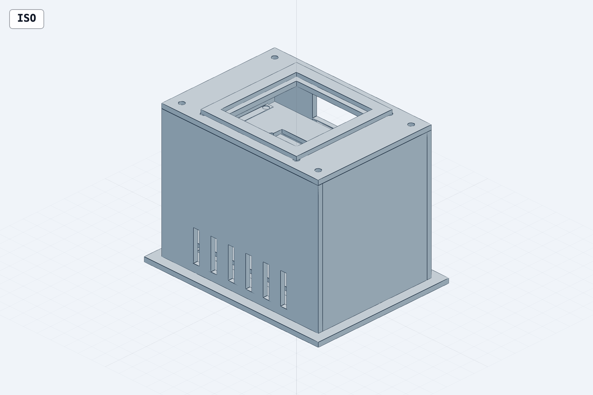

# Home Lab

A headless, self-hosted home lab built around a Void Linux server, three Radxa
single-board computers, and an Oracle Cloud VPS. This repository documents the
hardware, services, and fabrication projects that make up the lab. Keep
credentials, Cloudflare tunnel tokens, OIDC client secrets, and production
configuration out of the repository.

## At a glance

| Area | What runs there |
| --- | --- |
| Void Linux home-server laptop | Podman media stack, Jellyfin, Hermes, Nomad, Tailscale, and the local control plane |
| Radxa Cubie A5E | DIY router, Nomad, and Tailscale |
| Radxa Cubie A7A | General-purpose SBC node, Nomad, Tailscale, and enclosure fan-header source |
| Radxa ZERO 3E | DNS filtering with AdGuard, Nomad, and Tailscale |
| Oracle Cloud VPS | Publicly reachable self-hosted applications, identity services, Nomad, and Tailscale |



## Home automation

Home Assistant configuration is maintained in the separate
[HomeAssistant repository](https://github.com/imnotdev25/HomeAssistant). An RF
receiver was used to reverse-engineer the fan remote, then an ESPHome bridge
was created so Home Assistant can control the fan.

Home Assistant is available remotely through Cloudflare Tunnel (`cloudflared`),
which exposes the service without directly opening the home network to the
internet. Logto provides the lab's OpenID Connect (OIDC) identity layer. Store
the tunnel credentials, Logto client secret, redirect URLs, and any external
hostname settings only in the respective deployment's secret/configuration
store.

## Compute and networking

Nomad is connected across the lab's instances so workloads can use available
compute capacity across the home server, Radxa nodes, and Oracle Cloud VPS.
Tailscale runs throughout the lab as the private management network, providing
remote access to each enrolled machine without exposing its management ports
to the public internet.

### Void Linux server

The main server is a headless Void Linux machine with an Intel 7th-generation
i3, 8 GB RAM, and a 1 TB NVMe drive. It uses Podman to host the media stack
and Jellyfin.

### Radxa nodes

| Node | Resources | Role |
| --- | --- | --- |
| Radxa Cubie A5E | 2 GB RAM, 128 GB storage | Router; see [DIY Gaming Router](https://github.com/imnotdev25/DIY-Gaming-Router) |
| Radxa Cubie A7A | 6 GB RAM, 32 GB eMMC | General SBC node |
| Radxa ZERO 3E | 1 GB RAM, 64 GB storage | DNS filtering with AdGuard |

## Media server

The Void Linux server runs the media applications in a shared rootful Podman
pod named `yams_pod`. The shared pod network exposes Jellyfin on `8096` and
the media-management tools on their assigned ports. The commands below are a
record of the current deployment; mount paths and image tags should be reviewed
before reuse on another host.

```sh
sudo podman pod create \
  --name yams_pod \
  -p 8096:8096 -p 8081:8081 -p 8080:8080 -p 8989:8989 \
  -p 7878:7878 -p 8686:8686 -p 6767:6767 -p 9696:9696 -p 8888:8888

# qBittorrent — torrent downloader
sudo podman run -d --name qbittorrent --pod yams_pod \
  -e PUID=1000 -e PGID=1000 -e WEBUI_PORT=8081 \
  -v /home/boss/yams-media:/data \
  -v /opt/yams/config/qbittorrent:/config:z \
  lscr.io/linuxserver/qbittorrent:4.6.3

# SABnzbd — Usenet downloader
sudo podman run -d --name sabnzbd --pod yams_pod \
  -e PUID=1000 -e PGID=1000 \
  -v /home/boss/yams-media:/data \
  -v /opt/yams/config/sabnzbd:/config:z \
  lscr.io/linuxserver/sabnzbd:latest

# Sonarr — TV manager
sudo podman run -d --name sonarr --pod yams_pod \
  -e PUID=1000 -e PGID=1000 \
  -v /home/boss/yams-media:/data \
  -v /opt/yams/config/sonarr:/config:z \
  lscr.io/linuxserver/sonarr:latest

# Radarr — movie manager
sudo podman run -d --name radarr --pod yams_pod \
  -e PUID=1000 -e PGID=1000 \
  -v /home/boss/yams-media:/data \
  -v /opt/yams/config/radarr:/config:z \
  lscr.io/linuxserver/radarr:latest

# Lidarr — music manager
sudo podman run -d --name lidarr --pod yams_pod \
  -e PUID=1000 -e PGID=1000 \
  -v /home/boss/yams-media:/data \
  -v /opt/yams/config/lidarr:/config:z \
  lscr.io/linuxserver/lidarr:latest

# Bazarr — subtitle manager
sudo podman run -d --name bazarr --pod yams_pod \
  -e PUID=1000 -e PGID=1000 \
  -v /home/boss/yams-media:/data \
  -v /opt/yams/config/bazarr:/config:z \
  lscr.io/linuxserver/bazarr:latest

# Prowlarr — indexer sync
sudo podman run -d --name prowlarr --pod yams_pod \
  -e PUID=1000 -e PGID=1000 \
  -v /opt/yams/config/prowlarr:/config:z \
  lscr.io/linuxserver/prowlarr:latest
```

YAMS coordinates the download and media-management workflow; Jellyfin serves
the resulting media library. The Jellyfin container definition is deliberately
not repeated here because it was not included with this deployment record.

## Oracle Cloud VPS services

Coolify manages the applications hosted on the Oracle Cloud VPS. The public
service group consists of:

- Karakeep for bookmarking
- LiteLLM Proxy Gateway for AI model access
- Langfuse for tracing AI calls
- Immich for photo management
- Stirling PDF tools
- SearXNG metasearch
- Logto as the identity provider used by Karakeep and other OIDC-enabled apps

Hermes runs on the Void Linux home-server laptop rather than the Oracle Cloud
VPS. Beszel monitors the components throughout the lab, including the home
server and cloud workloads.

## Documentation and infrastructure

The in-depth operational documentation is in [docs/README.md](docs/README.md).
The recorded Podman deployment is available as an idempotent script at
[infra/media-server/deploy-yams-pod.sh](infra/media-server/deploy-yams-pod.sh);
its usage notes are in [infra/README.md](infra/README.md).

---

## Fabrication projects

### Radxa triple-SBC enclosure

Design files for a compact, serviceable enclosure for the Radxa nodes. The
project is ready to fabricate: it includes individually printable STL files,
editable STEP exports, assembly-reference models, preview renders, and the
parametric CAD source used to generate them.



#### Enclosure specifications

The enclosure houses one Radxa Cubie A5E, one Radxa Cubie A7A, and one Radxa
ZERO 3E in separate removable trays. It is a screw-together design with
filtered, top-down 5010-fan cooling and external access to the expected ports.

| Feature | Design detail |
| --- | --- |
| Footprint | 120 × 90 mm stabilizing plinth |
| Cooling | 5 V, 50 × 50 × 10 mm (5010) fan, cloth dust filter, front exhaust slots |
| Service access | Ethernet at the rear; three USB-C openings on the left; SD-card clearance on the right |
| Construction | Detachable walls and lid with nylon M3 hardware |
| Board mounting | A5E on 15 mm spacers; A7A and ZERO 3E on independent removable trays |

The full enclosure guide, including clearances and the complete bill of
materials, is in [radxa-enclosure/README.md](radxa-enclosure/README.md).

## Get printing

1. Open [radxa-enclosure/exports/print-ready](radxa-enclosure/exports/print-ready) in your slicer.
2. Import the ten STL files separately. They are single, closed solids and are
   already placed with a flat face on the build plate.
3. Start with PETG or ASA, 0.20 mm layers, four perimeters, and 30–40% infill.
   Add supports only where your slicer identifies a local overhang.
4. Print and fit-check the board trays before printing the walls and fan lid.

Do **not** slice the multi-body STL or 3MF files under
`assembly-reference/` as a single part; they are only for checking the complete
assembly.

### Printed parts

Print one of each:

- Base plinth, front wall, rear wall, left wall, and right wall
- A5E tray, A7A tray, and ZERO 3E tray
- Fan lid and cloth-filter retainer

The canonical print list and matching STEP files are documented in
[print-ready/README.md](radxa-enclosure/exports/print-ready/README.md).

## Hardware and assembly

In addition to the three boards, the design needs a 5 V 5010 axial fan, a
small piece of cloth filter media (about 52 × 52 mm), and nylon M3 hardware.
The detailed component list has exact counts in the
[assembly BOM](radxa-enclosure/exports/assembly-reference/radxa_enclosure_detailed_bom.md).

Recommended assembly order:

1. Install the A5E on its four 15 mm female-to-female M3 spacers on the base.
2. Fasten the A7A and ZERO 3E to their own trays.
3. Attach the front, rear, left, and right walls to the base.
4. Slide or fasten the tray assemblies into place, confirming Ethernet,
   USB-C, and SD-card access.
5. Put the filter material beneath the retainer, attach the fan lid, and
   install the fan so it pushes air down through the filter toward the boards.
6. Before powering the fan, verify the A7A fan-header voltage, pinout, and fan
   polarity.

## Repository layout

```text
radxa-enclosure/
├── README.md                         Enclosure design, printing notes, and BOM
├── exports/
│   ├── print-ready/                  Individual STL and STEP fabrication files
│   ├── assembly-reference/           Multi-body reference files and detailed BOM
│   └── previews/                     Renders of the design and printable parts
└── models/                           Parametric build123d Python source and CAD models
```

## Working with the CAD source

The source files in `radxa-enclosure/models/*.step.py` are parametric
build123d models. They are useful when changing board locations, mounting
patterns, enclosure dimensions, or cooling features. Generated STEP, STL, and
3MF files are retained in the repository so printing does not require a CAD
environment.

Treat the existing export files as the release artifacts. If you regenerate
them after a source change, re-check print orientation, clearances, and the
bill of materials before replacing the corresponding files under `exports/`.
